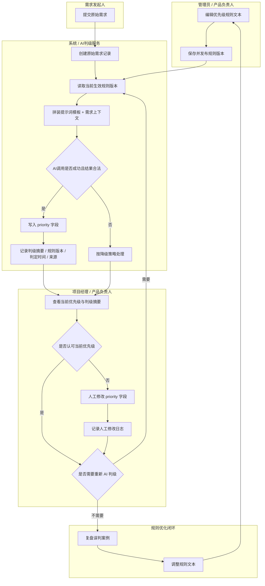

# 业务流程图

## 流程说明

本次流程围绕“规则配置 -> 原始需求提交 -> AI 自动判级 -> 人工复核/修正 -> 规则持续优化”展开。核心原则如下：

1. 优先级始终由同一个字段承载，不拆分 AI 建议值和人工最终值。
2. AI 自动判级是默认入口，但人工可以覆写。
3. AI 判级依赖当前生效规则版本和固定提示词模板。
4. 每次 AI 判级或人工改写都要留下可追溯记录。

